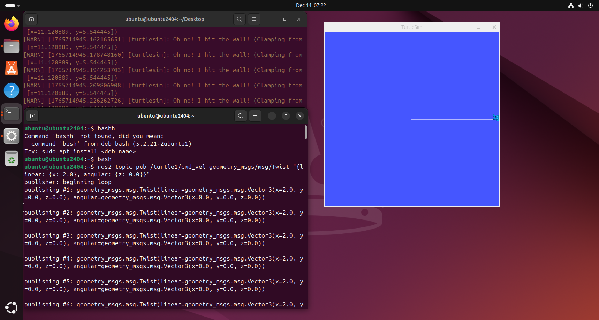
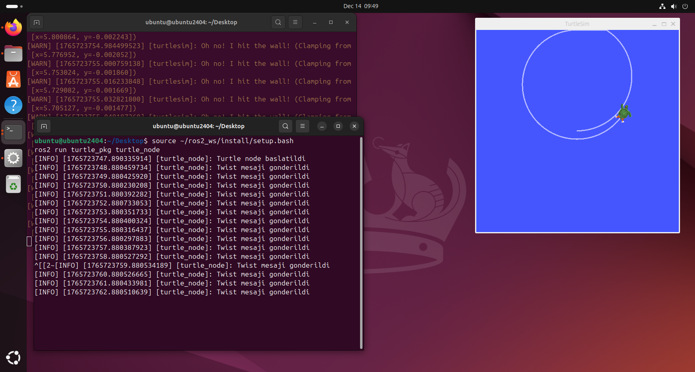

# ODEV 5 
ROS (Robot Operating System) 

ROS Nedir?

ROS ,robotik sistemlerin geliştirilmesi için kullanılan açık kaynaklı bir yazılım çerçevesidir. ROS; donanım soyutlama, mesajlaşma altyapısı, paket yönetimi ve çeşitli geliştirme araçları sunarak robot yazılımlarının daha esnek ve ölçeklenebilir şekilde geliştirilmesini sağlar.

ROS bir işletim sistemi değildir. Linux (Ubuntu) üzerinde çalışır.

ROS’un Temel Bileşenleri

- Node:Belirli bir görevi yerine getiren çalışan programlardır.
- Topic:Node’lar arasında veri aktarımı yapılan iletişim kanalıdır.
- Publisher:Topic üzerinden veri yayınlayan node’dur.
- Subscriber:Topic üzerinden veri alan node’dur.
- Service:İstek–cevap mantığıyla çalışan haberleşme yapısıdır.
- Action:Uzun süren görevler için kullanılır, geri bildirim sağlar.
- Parameter:Node’ların yapılandırma bilgilerini tutar.

ROS 1 ve ROS 2 Arasındaki Farklar

-Ros2 gerçek zaman desteği sunar.
-Ros1 dds kullanmaz Ros2 kullanır.
-Ros2 endüstriye daha uygun.
ROS 2, ROS 1’in eksiklerini gidermek amacıyla geliştirilmiştir.
---
ROS’un Kullanım Alanları

- Mobil robotlar  
- Otonom araçlar  
- Drone sistemleri  
- Endüstriyel robotlar  
- Simülasyon ve test ortamları
 
Otonom Araçlarda ROS

ROS, otonom araç projelerinde sensör verilerinin işlenmesi, yol planlama, kontrol algoritmaları ve simülasyon ortamlarında test edilmesi için yaygın olarak kullanılmaktadır. Kamera, Lidar, ve GPS gibi sensörlerden gelen veriler ROS altyapısı üzerinden yönetilir.

---
ROS2 Temel Komutları

```bash
ros2 node list
ros2 topic list
ros2 topic echo /turtle1/cmd_vel
ros2 interface show geometry_msgs/msg/Twist 
---ROS2 Workspace Olusturulmasi

Bu asamada ROS2 ile calisabilmek icin 'ros2_ws' isimli bir workspace olusturulmustur.
Workspace 'src','build','install' ve 'log' klasorlerinden olusmaktadir.

**Turtlesim ve Twist Kullanimi 

 ROS2 Jazzy kurulumu sonrasinda turtlesim paketi kullandim
Turtlesim node'u calistirildiktan sonra '/turtle1/cmd_vel' topic'ine Twist mesaji gonderdim.

bash 
ros2 topic pub /turtle1/cmd_vel geometry_msgs/msg/Twist "{linear: {x: 2.0}, angular:{z: 0.0}}"

Sonrasinda kaplumbaganin hareket etti. Ekte gorsel mevcut. 




~Turtlesim Ornek Paketi

Bu asamada ROS2 uzerinde Python tabanli 'turtle_pkg' isimli bir paket olusturdum.(Paket adini istediğiniz gibi olusturmadigimi sonradan fark ettim.)
Paket icerisinde yazilan node ile 'turtlesim' uygulamasina twist gonderdim ve kaplumbaga dondu.
Bu asamada yapay zekadan yardim aldim.

